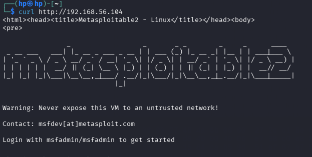

Yes. Since you actually performed **`ifconfig → ping → nmap → Wireshark → curl → Wireshark scan`** using a Linux machine and **Metasploitable**, your README should follow those exact steps.

# COM 512 – Offensive and Defensive Security Lab

## Experiment: Basic Network Traffic Analysis with Wireshark

### Aim

To capture and analyze network traffic between a Linux machine and a simulated **Metasploitable** system using Wireshark, and identify different types of network packets and potentially cleartext HTTP traffic.

### Theory

**Wireshark** is a network protocol analyzer used to capture and inspect packets travelling through a network. It can help identify protocols, source and destination IP addresses, ports, and suspicious or insecure communication.

In this experiment, a Linux machine communicates with a Metasploitable virtual machine. Commands such as `ping`, `nmap`, and `curl` are used to generate different types of network traffic. Wireshark is then used to capture and examine these packets.

---

## Step 1: Check Network Configuration

On the Linux machine, open the terminal and run:

```bash
ifconfig
```

Identify the IP address and network interface of the Linux machine.

**Screenshot 1:** Output of `ifconfig`.


## Step 2: Test Connectivity with Metasploitable

Use `ping` to check whether the Linux machine can communicate with Metasploitable.

```bash
ping <Metasploitable-IP>
```

For example:

```bash
ping 192.168.56.101
```

Stop the command using:

```text
Ctrl + C
```

**Screenshot 2:** Successful ping replies from Metasploitable.


## Step 3: Perform a Basic Nmap Scan

Run a basic scan against the **lab Metasploitable machine**:

```bash
nmap <Metasploitable-IP>
```

Example:

```bash
nmap 192.168.56.101
```

Observe the open ports and services reported by Nmap.

**Screenshot 3:** Nmap scan results.


## Step 4: Start Wireshark and Capture Traffic

Open Wireshark:

```bash
sudo wireshark
```

1. Select the network interface used for communication.
2. Start packet capture.
3. Generate some traffic between Linux and Metasploitable.
4. Observe the packets appearing in Wireshark.

You can use filters such as:

```text
icmp
```

for ping traffic, or:

```text
tcp
```

for TCP traffic.

**Screenshot 4:** Wireshark capturing packets.


## Step 5: Generate HTTP Traffic Using cURL

Use `curl` to access the HTTP service in the lab:

```bash
curl http://<Metasploitable-IP>
```

Example:

```bash
curl http://192.168.56.101
```

This generates HTTP traffic that can be observed in Wireshark.

In Wireshark, use:

```text
http
```

as the display filter.

**Screenshot 5:** HTTP packets visible in Wireshark after using `curl`.



## Step 6: Analyze the Captured Packets

Select an HTTP packet in Wireshark and examine:

* Source IP
* Destination IP
* Protocol
* Source/Destination port
* HTTP request/response information

You can also use:

**Right-click packet → Follow → TCP Stream**

to examine the contents of the lab HTTP communication.

**Screenshot 6:** Wireshark packet/TCP stream analysis.


## Result

The network traffic between the Linux machine and Metasploitable was successfully captured and analyzed using Wireshark. **Ping, Nmap, and HTTP/cURL traffic** were identified through packet analysis and Wireshark filters.

## Conclusion

This experiment demonstrated how Wireshark can be used to monitor and analyze network traffic. The captured packets helped identify different protocols, IP addresses, ports, and HTTP communication. It also demonstrated why **unencrypted HTTP traffic can expose transmitted information** and should be replaced with secure protocols such as HTTPS in real networks.
